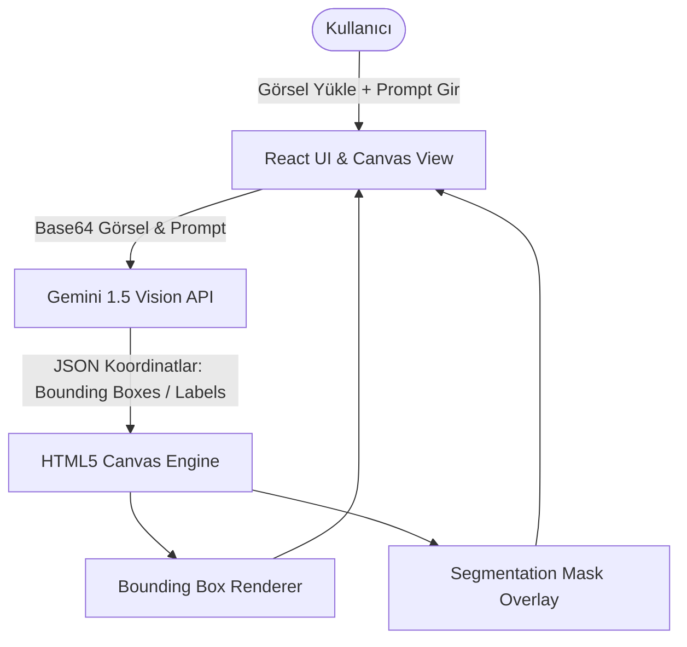

# 🎯 Image Find Object - AI Vision Object Detection & Segmentation Visualizer

[](https://www.typescriptlang.org/)
[](https://reactjs.org/)
[](https://vitejs.dev/)
[](https://developer.mozilla.org/en-US/docs/Web/API/Canvas_API)
[](https://deepmind.google/technologies/gemini/)
[](https://www.yucelgumus.dev/)

> Yüklenen veya örnek fotoğraflar üzerindeki nesneleri **Google Gemini Multimodal Vision** modelleri ile tespit eden; koordinatları interaktif HTML5 Canvas üzerinde sınırlayıcı kutular (bounding boxes) ve segmentasyon maskeleri (segmentation overlays) ile hassas biçimde görselleştiren bilgisayarla görme (computer vision) stüdyosu.

---

## 🌟 Öne Çıkan Özellikler

- 📦 **Hassas Sınırlayıcı Kutu (Bounding Box) Tespiti:** Görseldeki nesnelerin normalleştirilmiş `[ymin, xmin, ymax, xmax]` koordinatlarını çıkarır ve Canvas üzerinde renkli çerçevelerle çizer.
- 🎭 **Segmentasyon Maskeleri (Segmentation Overlays):** Nesnelerin şekil konturlarını ve alanlarını vurgulayan gelişmiş maskeleme katmanı (`SegmentationMaskOverlay.tsx`).
- 🎨 **Özelleştirilebilir Renk Paleti & Filtreler:** Algılanan farklı nesne sınıflarını görsel olarak ayrıştırmak için dinamik renk paleti yönetimi (`Palette.tsx`).
- ✍️ **Serbest Prompt Sorgulama:** *"Sadece masadaki fincanları bul"* veya *"Kırmızı arabanın tekerleklerini işaretle"* gibi özel prompt tabanlı hedefli tespit.
- ⚡ **Jotai / Atomic State Yönetimi:** Canvas yeniden çizimlerinde (re-render) yüksek kare hızı ve sıfır gecikmeli etkileşim.

---

## 🏗️ Mimari & Çalışma Akışı



| Bileşen | Görev |
| :--- | :--- |
| **`src/services/gemini.ts`** | Gemini Vision API çağrıları ve koordinat formatlayıcı |
| **`src/utils/canvas.ts`** | Çizim motoru, DPI optimizasyonu ve kutu render algoritmaları |
| **`src/components/overlays/`** | `BoxMask` ve `SegmentationMaskOverlay` görselleştiricileri |
| **`src/store/atoms.ts`** | Algılanan nesneler, seçili renkler ve mod durumu |

---

## 🚀 Hızlı Başlangıç

### Gereksinimler
- **Node.js**: v18.0+
- **Google Gemini API Key**

### Kurulum

```bash
git clone https://github.com/yucel-gumus/image_find_object.git
cd image_find_object

npm install
```

### Ortam Değişkenleri (`.env`)

```env
VITE_GEMINI_API_KEY=your_gemini_api_key_here
```

### Çalıştırma

```bash
npm run dev
```

---

## 📂 Proje Dizin Yapısı

```
image_find_object/
├── api/
│   └── analyze-image.ts            # Görsel analiz serverless endpoint
├── index.html
├── package.json
├── vite.config.ts
└── src/
    ├── main.tsx
    ├── App.tsx
    ├── store/atoms.ts              # Global durum (Jotai)
    ├── services/gemini.ts          # Gemini Vision istemcisi
    ├── utils/
    │   ├── canvas.ts               # Canvas çizim yardımcıları
    │   └── consts.ts               # Renk ve etiket sabitleri
    └── components/
        ├── Content.tsx             # Ana çalışma alanı
        ├── TopBar.tsx              # Üst kontrol çubuğu
        ├── Palette.tsx             # Renk paleti seçici
        ├── DetectTypeSelector.tsx  # Tespit türü (Kutu / Segmentasyon)
        └── overlays/               # Canvas maske ve çerçeve bileşenleri
```

---

## 📄 Lisans
Bu proje [MIT Lisansı](LICENSE) ile lisanslanmıştır.

---

## 👨‍💻 Geliştirici & İletişim

**Yücel Gümüş** - Full Stack Developer

- 🌐 **Web Sitesi / Portfolyo:** [yucelgumus.dev](https://www.yucelgumus.dev/)
- 💼 **LinkedIn:** [linkedin.com/in/yucel-gumus](https://www.linkedin.com/in/yucel-gumus/)
- 🐙 **GitHub:** [@yucel-gumus](https://github.com/yucel-gumus)

<p align="left">
  <a href="https://www.yucelgumus.dev/" target="_blank" rel="noopener noreferrer">
    
  </a>
</p>